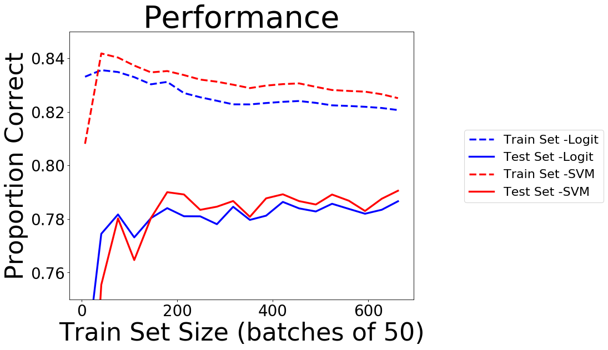
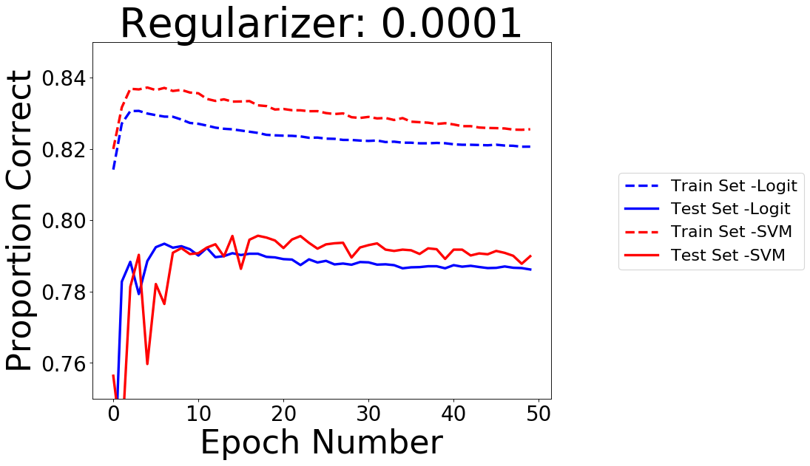
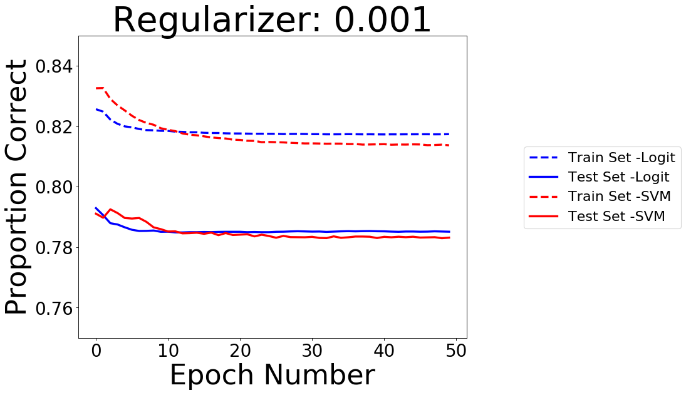
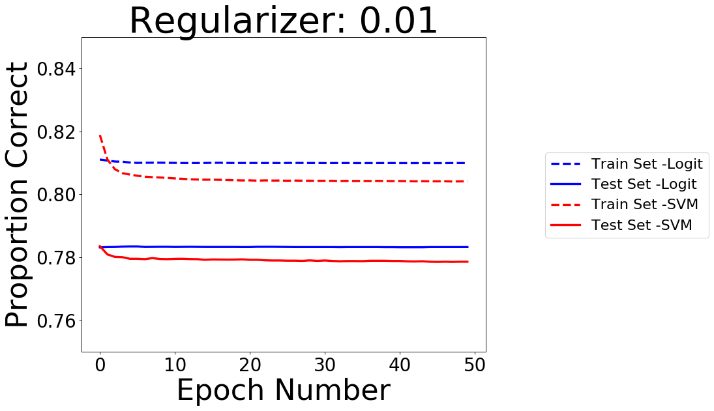
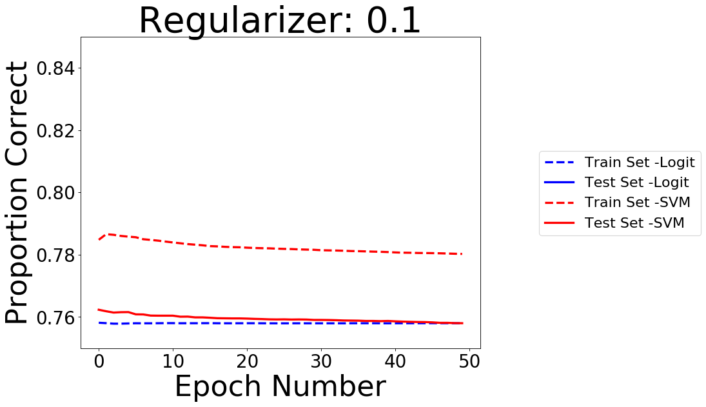

# accelerometerClassification

This is a toy machine learning problem with classifying body postures and movements of people wearing accelerometer devices from a publicly available dataset.

A description of the dataset and the csv file with class assignment can be found here: https://archive.ics.uci.edu/ml/datasets/Wearable+Computing%3A+Classification+of+Body+Postures+and+Movements+%28PUC-Rio%29#

#### Description of What the Code Does

- 'accelerometerCalssification.py' imports the data from the csv file, than splits it into training and testing sets. The data goes  through several preprocessing steps (scaling, filling in NaNs with averages, etc), and Python's sklearn library is used to compare classification performance with a logistic regression model in addition to an svm model. Some error analysis plots are created to try to determine whether there is enough training data for the number and informativeness of the given features in addition to testing different regularizer parameter values for each of the two models. Although this dataset is relatively small and can be loaded into RAM in its entirety, the code uses a mini-batch stochastic gradient descent version of the logistic regresseion and support vector machine algorithms in case a larger dataset is eventually used instead. 

#### Error Analysis

##### Effects of Training Size on Performance

The plot below shows the effects of having a larger training set size on both training and test performance. Each training set size is run for 50 epochs and performance from the last epoch is plotted. Test set performance quickly starts converging to the asymptotic optimal performance using even just a third of the training set (which is already set in the code to be only 80% of the available data). This suggests that adding more data with the same features would not improve performance much. Instead, performance may be improved by adding more informative features or manipulating the existing ones. 

##### Effects of Regularizer Values on Performance

The four plots below show the effects of using differenct regularizer values on performance across 50 epochs. The differences in performance of the test set are minimal with different regularizer values, except when the value is too large. In this case, both models start to exhibit high bias. 

